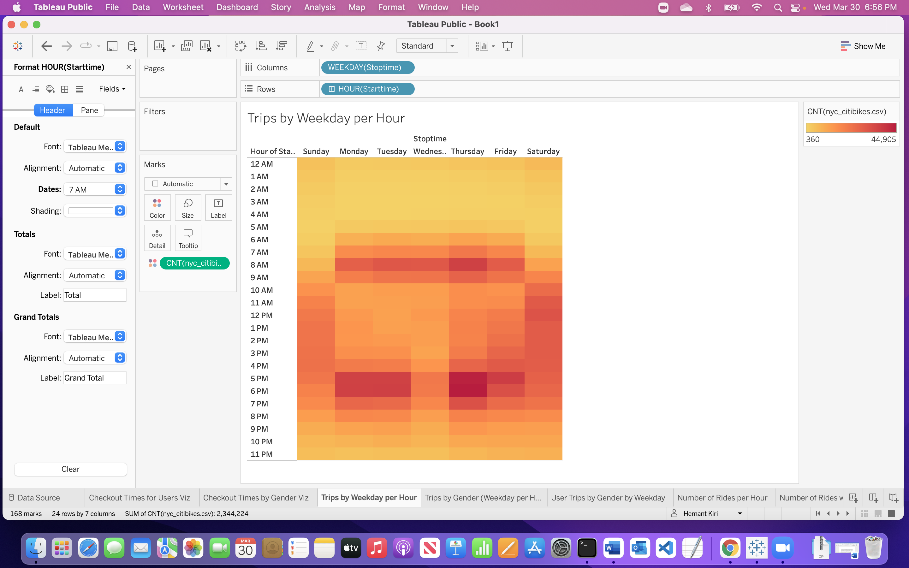
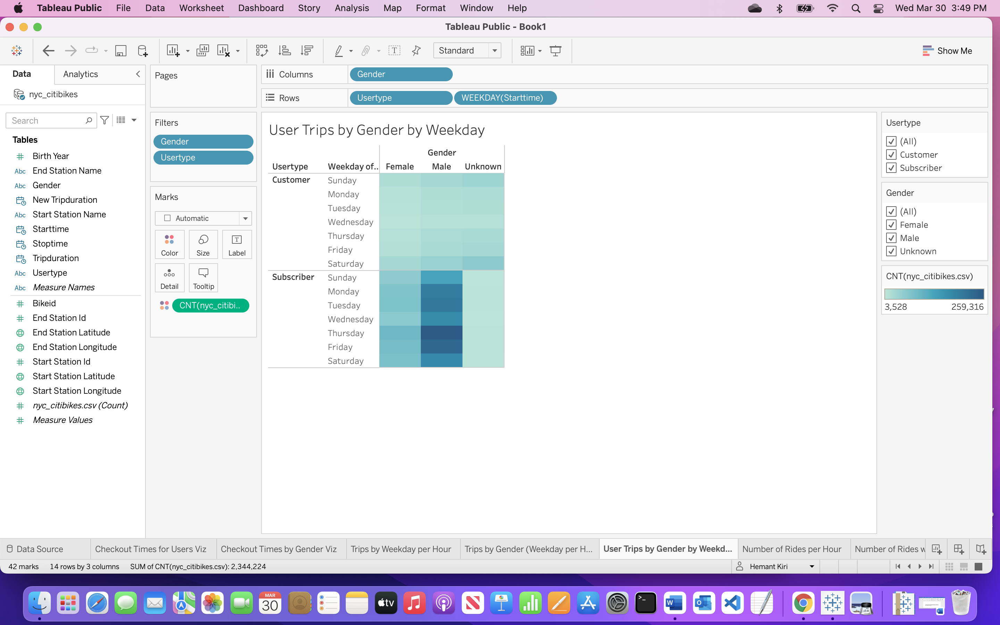
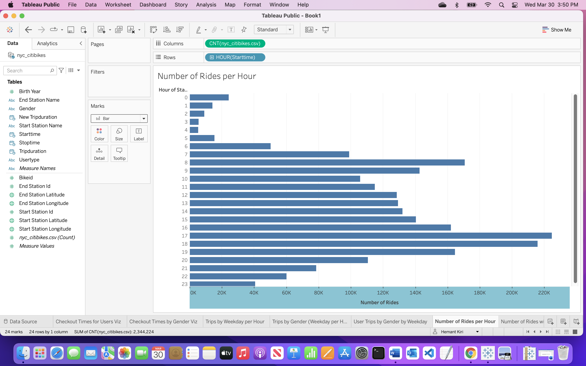
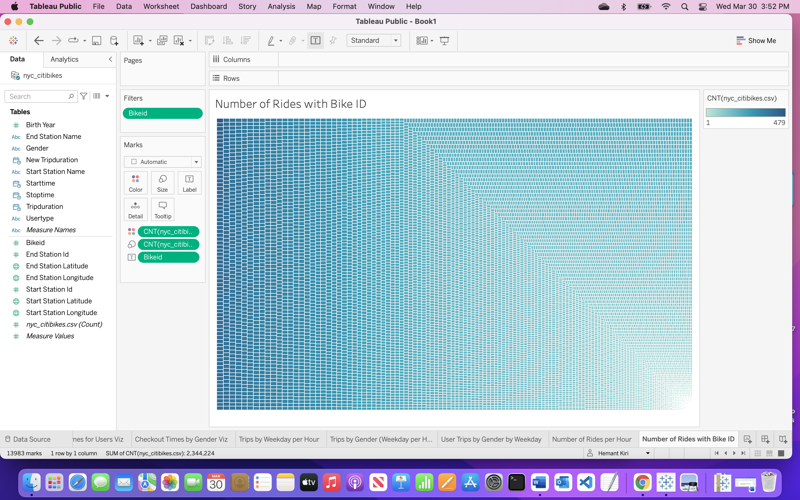
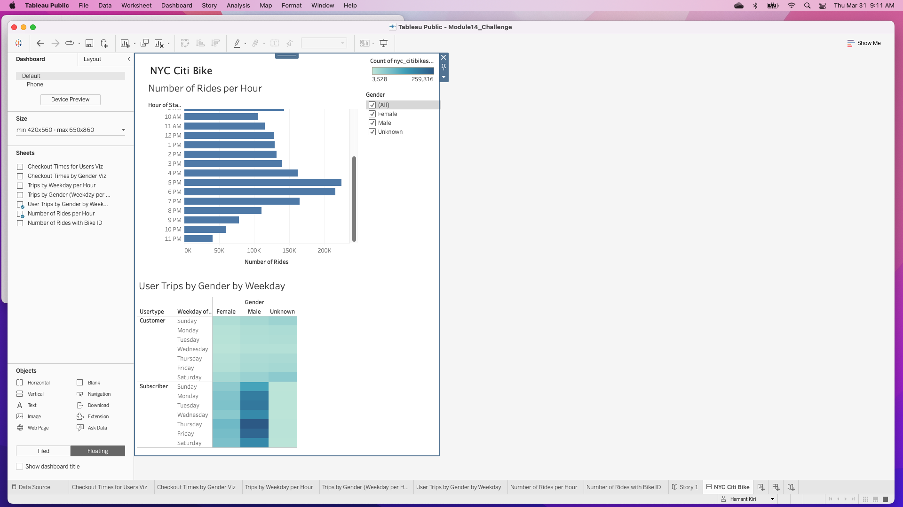
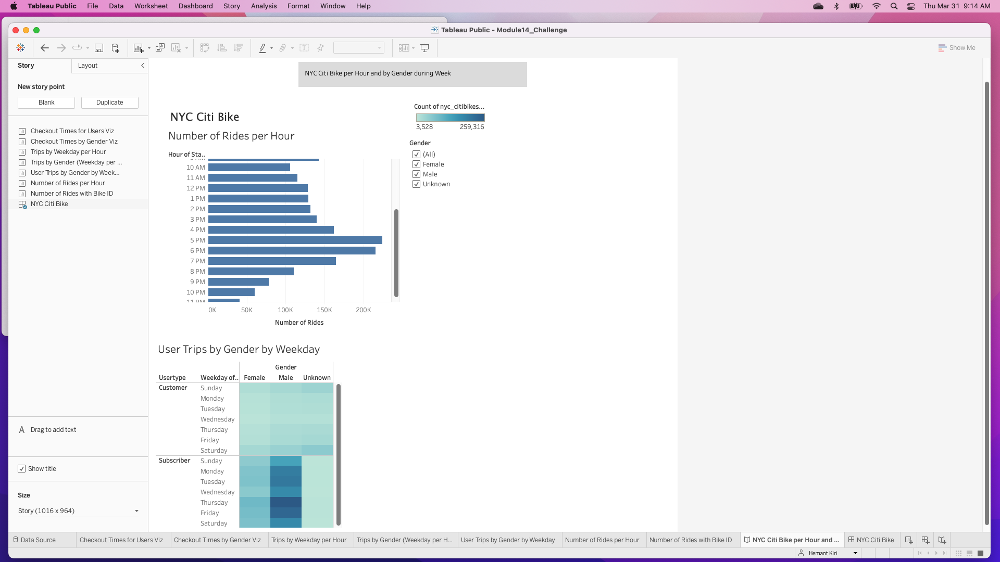
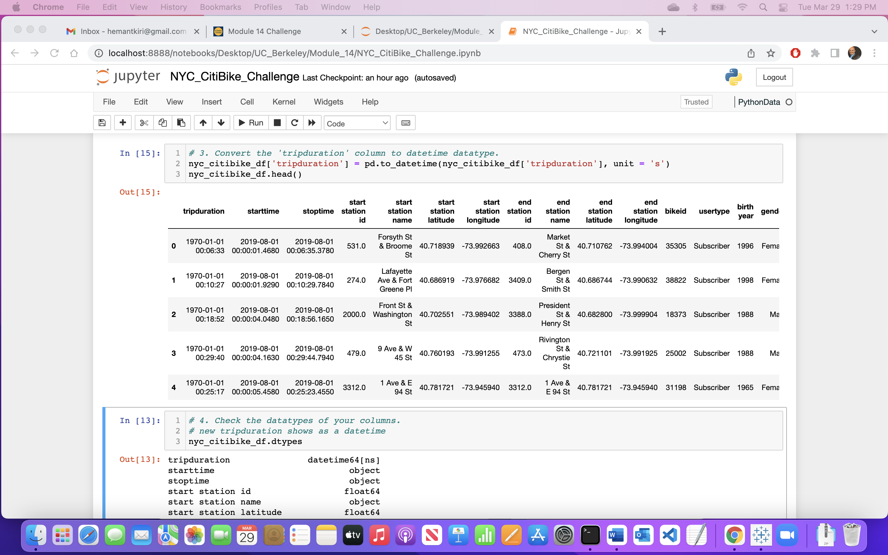

# bikesharing

# Overview of the statistical analysis:
To convince investors that a bike-sharing program in Des Moines is a solid business proposal using NYC Bike data.

# Data
"Citi Bike System Data page" site, in the "Citi Bike Trip Histories" section, click the link that says "downloadable files of Citi Bike trip data,
Scroll down the list to and download "201908-citibike-tripdata.csv.zip" file.

# Results:
Using the converted datatype created below listed visualizations images. I have also attached ‘Deliverable1 step7’ image from ‘NYC_CitiBike_Challenge.ipynb’ file.

# Summary:
For NYC, male subscribers are the highest users of travel to and from work specially on Thursday. Weekend riders are along the river.
Analysis geographical activity review in Des Moines. If possible to install travel tracker on bike to count the travel distance and the location for nearby station for repair.

# .gitignore (noted files, used in ipynb)
1.	201908-citibike-tripdata.csv
2.	Nyc_citibikes.csv
